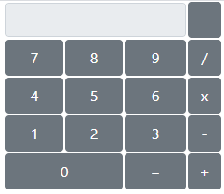

# Calculator
간단한 연산이 가능한 계산기

## 프로젝트 소개
간단한 사칙연산이 가능한 계산기를 만든 페이지 입니다.
덧셈, 뺄셈, 나눗셈, 곱셈을 연산할 수 있는 함수를 구현하였으며,
테이블을 이용하여 버튼들의 위치를 계산기와 유사하고 깔끔하게 구현할 수 있었습니다.

## 작업 환경
- 언어 : JavaScript, HTML, CSS
- 개발도구 : 이클립스
- 운영체제 : Windows
- 형상관리 : git, github

## 구현 화면

